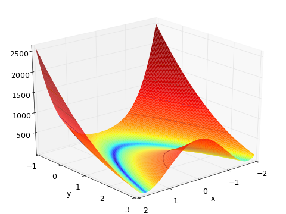
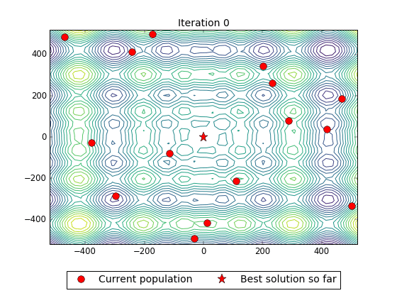

Pallas Solver
=============

This project is a suite of global optimization algorithms for C++ inspired by SciPy's global optimization package.
Currently supported functions are:

  * pallas::Basinhopping
  * pallas::Brute
  * pallas::DifferentialEvolution
  * pallas::SimulatedAnnealing


<!-- For more information on the options for each optimizer please navigate to the
documentation for each algorithm by clicking on the function above. -->
For more information on the options for each algorithm please see the documentation at: http://latture.github.io/pallas-solver

Dependencies
------------
 * C++11 compatible compiler.
 * [glog](https://github.com/google/glog)
 * [CMake](http://www.cmake.org/)
 * [Ceres](http://ceres-solver.org/)

Building and Installation
-------------------------
To use this library first install glog and CMake. Pallas is based off of the Google Ceres project which has extensive
use of glog for logging and debugging features, and this functionality is carried over into Pallas. Follow the
instructions to install Ceres at <a href="http://ceres-solver.org/building.html">ceres-solver.org/building.html</a>.
Once CMake, Ceres, and glog are built and installed use the following steps to build Pallas:
  * Navigate to the pallas root directory.
  * On the same level as the `README.md`, create a folder named `build`.
  * In the terminal, navigate to the newly created `build` folder.
  * Execute the following command: `cmake .. -DCMAKE_PREFIX_PATH=/path/to/CeresConfig.cmake`, where
      `/path/to/CeresConfig.cmake` denotes the folder where the file `CeresConfig.cmake` is located
      Currently on Linux, Ceres by default will place this file at `/usr/local/share/Ceres`, though
      this may change in the future and may be different on your machine.
  * From within the same build directory execute `make` in the terminal.
This should build Pallas. The folder `build/lib` will hold the library

Example
-------
The Rosenbrock function (shown below) is a commonly used benchmarking function for optimization algorithms.
The global minimum is in the middle of a narrow valley at `f(x, y) = 0` when `x = y = 1`.
Finding the valley is fairly easy; however, finding the global minimum is quite a bit harder...


```cpp
#include "glog/logging.h"

// Each solver is defined in its own header file.
// include the solver you wish you use:
#include "pallas/basinhopping.h"

// define a problem you wish to solve by inheriting
// from the pallas::GradientCostFunction interface
// and implementing the Evaluate and NumParameters methods.
class Rosenbrock : public pallas::GradientCostFunction {
public:
    virtual ~Rosenbrock() {}

    virtual bool Evaluate(const double* parameters,
                          double* cost,
                          double* gradient) const {
        const double x = parameters[0];
        const double y = parameters[1];

        cost[0] = (1.0 - x) * (1.0 - x) + 100.0 * (y - x * x) * (y - x * x);
        if (gradient != NULL) {
            gradient[0] = -2.0 * (1.0 - x) - 200.0 * (y - x * x) * 2.0 * x;
            gradient[1] = 200.0 * (y - x * x);
        }
        return true;
    }

    virtual int NumParameters() const { return 2; }
};

int main(int argc, char** argv) {
    google::InitGoogleLogging(argv[0]);

    // define the starting point for the optimization
    double parameters[2] = {-1.2, 0.0};

    // set up global optimizer options only initialization
    // is need to accept the default options
    pallas::Basinhopping::Options options;

    // initialize a summary object to hold the
    // optimization details
    pallas::Basinhopping::Summary summary;

    // create a problem from your cost function
    pallas::GradientProblem problem(new Rosenbrock());

    // solve the problem and store the optimal position
    // in parameters and the optimization details in
    // the summary
    pallas::Solve(options, problem, parameters, &summary);

    std::cout << summary.FullReport() << std::endl;
    std::cout << "Global minimum found at:" << std::endl;
    std::cout << "\tx: " << parameters[0] << "\ty: " << parameters[1] << std::endl;

    return 0;
    }
```

After compiling and running, the console should display the following:

```txt
Solver Summary

Parameters                                  2
Line search direction                   LBFGS

Cost:
  Initial                        2.122000e+02
  Final                          3.300841e-27
  Change                         2.122000e+02

Minimizer iterations                       21

Time (in seconds):
  Cost evaluation                      0.0000
  Local minimization                   0.0015
  Step function                        0.0000
  Total                                0.0015

Termination: CONVERGENCE (Maximum number of stagnant iterations reached.)

Global minimum found at:
	x: 1	y: 1
```

This example (among others) can be found in the examples folder.

Getting started
---------------
Pallas global optimization algorithms take as inputs an `Options` struct class specific
to each optimizer, `GradientProblem` which encapsulates the objective function to optimize,
a `const double*` pointing to the initial starting point for optimization
(except for Brute which takes a range of parameters), and a summary in which details of the
optimization are stored. The `Options` struct is a subclass specific to each optimizer
exposing the options that can be changed in order to customize the optimization procedure.
If Basinhopping is being used as the global optimizer, creating an instance of the default
options is as simple as:

```cpp
pallas::Basinhopping::Options options;
```

The default options can be changed by accessing member variables:

```cpp
options.maxiterations = 1000;
```

If the global optimizer employs a local minimizer, the options for the local minimizer
are accessed through the `options.local_minimizer_options` minimizer variable.
`options.local_minimizer_options` is itself a struct containing the parameters
to augment the functionality of the local minimization step(s). The local minimization
options are from the `ceres::GradientProblemSolver` renamed to `pallas::GradientLocalMinimizer`
to avoid confusion between the global and local solvers. If `DifferentialEvolution` is
being used as the global optimizer, the `options` struct requires that upper and lower
bounds be set for the current problem. Note, however, that if the final output is polished
(`options.polish = true`) the local optimization will not respect the bounds of the global
optimization due to the restriction of the Ceres local optimization algorithms to purely
unbounded problems. Both the `SimulatedAnnealing` and `Basinhopping` algorithms use
the `StepFunction` class to generate randomized candidate solutions. A pallas::scoped_ptr
to a `DefaultStepFunction` is created by default. This is not going to give optimal results
for your problem. If either of these algorithms are being used a class should inherit from
`StepFunction` and implement the `Step` method which takes as inputs a pointer to the
current solution and the number of parameters, then modifies the current solution in
place. If a `StepFunction` is used by the global optimizer, then the options struct
has a helper method `set_step_function` that swaps the pointer to the default step
function with the user defined functor. The following shows how to create a step
functor and replace it as the step function pointer in the options struct:

```cpp
// inherit from StepFunction and implement Step method
class CustomStepFunction : public pallas::StepFunction {
public:
    CustomStepFunction(double step_size)
        : random_number_(new pallas::internal::RandomNumberGenerator<double>(-step_size, step_size)) {
    };

    void Step(doublex, unsigned int num_parameters) {
        // implementation to modify x in place
    };

     private:
         pallas::scoped_ptr<pallas::internal::RandomNumberGenerator<double>> random_number_;
     };

// create the options for the solver
pallas::Basinhopping::Options options;

// instantiate scoped pointer to StepFunction
pallas::scoped_ptr< CustomStepFunction > step(new CustomStepFunction(1.0));

// use convenience method to replace default step function
options.set_step_function(step);
```

Subclassing `pallas::GradientCostFunction`
and implementing the `Evaluate` and `NumParameters` methods defines your objective function.
Create a `GradientProblem` using:

```cpp
pallas::GradientProblem problem(new YourObjectiveFuntion());
```

The gradient problem is what is then passed to the solver. The `parameters` for the global
optimization represents an initial guess required for the `Basinhopping` and `SimulatedAnnealing`
algorithms. It should be a `double*` and contain the same number of values as the `NumParameters`
method returns. Each global optimizer contains a `Summary` class used to store the results of
the global optimization. The summary is created in the same manner as the options struct, i.e.:

```cpp
pallas::Basinhopping::Summary summary;
```

This is then passed as the final parameter to the solver. There are 2 methods optimize a
cost function. An instance of the solver can be created then optimized using the `global_optimizer.Solve`
method. There is also a `pallas::Solve` function added for convenience. It is overloaded
to create a global optimizer instance and run the optimization based on the parameters
passed to the function. To summarize, the two method of optimization are given by:

```cpp
// create an instance of a global optimizer
pallas::Basinhopping bh;
bh.Solve(options, problem, parameters, &summary);

// bypass the creation of the optimizer
pallas::Solve(options, problem, parameters, &summary)
```

Description of Algorithms
-------------------------


To illustrate each algorithm we'll use Schwefel's function (shown above) defined as:

```cpp
class Schwefel : public pallas::GradientCostFunction {
public:
    virtual ~Schwefel() {}

    virtual bool Evaluate(const double* parameters,
                          double* cost,
                          double* gradient) const {

        double c = 0.0;
        for (auto i = 0; i < NumParameters(); ++i)
            c -= parameters[i] * std::sin(std::sqrt(abs(parameters[i])));
        cost[0] = 418.9829 * NumParameters() + c;

        if (gradient != NULL) {
            double g = 0.0;
            for (int i = 0; i < NumParameters(); ++i)
                gradient[i] = parameters[i] * cos(sqrt(abs(parameters[i]))) / (2.0 * pow(abs(parameters[i]), 1.5));
        }
        return true;
    }

    virtual int NumParameters() const { return 2; }
};
```

Full examples of each algorithm used to optimize Rosenbrock's function can be found in the `examples` folder.

### Brute ###


Brute force is a simple N-dimensional, grid-based search through the parameter space.
To use, specify the objective function and the parameter ranges via:

```cpp
std::vector<pallas::Brute::ParameterRange> ranges = {pallas::Brute::ParameterRange(-500.0, 500.0, 50),
                                                     pallas::Brute::ParameterRange(-500.0, 500.0, 50)}
```

This will divide the `ith` parameter into 7 equally spaced search points. The objective will be evaluated at each parameter combination. While not an efficient optimization strategy, brute force is often used as a coarse-grained search of the parameter space in order to identify areas of interest that can be further explored with other, more efficient, algorithms. 

### Simulated Annealing ###


Simulated annealing is a global optimization algorithm that doesn't need derivative information. Randomized steps are generated about the current solution vector forming a candidate solution. Then the current solution chooses whether or not accept (and thus to move to) the candidate solution based on the cost associated with the candidate solution. If it is lower than the current cost, the candidate solution is accepted. If it is higher, the candidate isn't simply thrown out. The current solution moves to a worse candidate solution with a given probability in hopes that accepting worse solutions will allow the algorithm to surmount local optima and find the global minimum. The likelihood of accepting a worse candidate solution is controlled by the system temperature: higher temperatures mean the worse candidate is more likely to be accepted. As optimization progresses, the temperature is slowly decreased (i.e. the system simulates an annealing process) and the likelihood of accepting worse candidate solutions is decreased later in the optimization. The method of cooling the system is controlled via a `CoolingSchedule`. Pallas provides three schedules: `FastCooling`, `CauchyCooling` and `BoltzmannCooling`. For information on how these control temperature see `pallas/cooling_schedule.h`.

### Basinhopping ###


Basinhopping is very similar to simulated annealing with one additional step: after each randomized step the candidate solution is fed into a local optimizer in order to move the candidate solution to the bottom of the current basin. This locally optimized candidate is then compared to the current solution in order to decide whether to accept the candidate. This allows the optimizer to traverse the energy landscape in a reduced subset of space where only local optima are present. In effect, much fewer total iterations are needed compared to simulated annealing, but this comes a higher cost per iteration because instead of simply taking a randomized step, a local optimization must be performed during each iteration (Notice the iteration count compared to simulated annealing). In general, when using `Basinhopping` you will need at least as many iterations as there are local optima.

### Differential Evolution ###



Differential evolution is different than the previous algorithms. Instead of maintaining a single current solution, it evolves a population of candidate solutions through a series of generations in order to find the global optimum. Children of the current population are created using crossover and mutation strategies. Crossover selects 1 or more individuals for reproduction then generates a candidate solution vector that undergoes mutation (with some probability) and is placed in the next generation's population. Crossover and mutation strategies are selected using the `DifferentialEvolution::Options` struct.

Contributor(s)
------------
 * Ryan Latture

Credits
-------
This library uses the local minimization algorithms from Google's Ceres solver.
Implementations of the global optimization algorithms are based on Scipy's
optimize package. Because of the similarities between the Pallas algorithms
and scipy.optimize, much of the documentation was adapted from their source.
